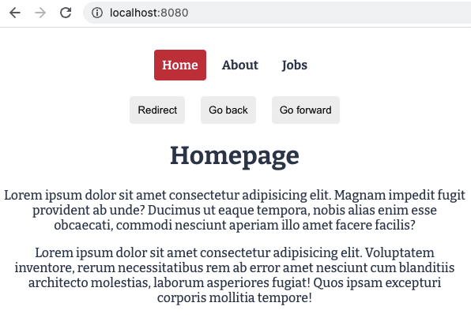

# Vue 3 CLI - Vue Router Example

## What is this about?
### This project has 2 branches

**Please check `main` for basic example**

- how do `router-view` and `router-link` work
- how to properly organise your folders and files in regard of that
- how to programmatically guide a user through a website

**Please check `fetching-data` for API mock with JSON Server**

- locally install JSON Server package https://www.npmjs.com/package/json-server `npm install json-server` to mock getting data from an external data base
- run JSON Server and have it watch the file you want to watch `npx json-server --watch data/db.json`
- conditionally show data on `JobDetails` after the fetch request has finished

## Tech Stack
- Vue 3 with Vue Router
- HTML, SCSS, JavaScript
- JSON Server

## Source
- [The Net Ninja - Vue JS 3 Tutorial for Beginners #8 - The Vue Router](https://www.youtube.com/watch?v=juocv4AtrHo&list=PL4cUxeGkcC9hYYGbV60Vq3IXYNfDk8At1&index=8)
- [The Net Ninja - Vue JS 3 Tutorial for Beginners #9 - Fetching Data](https://www.youtube.com/watch?v=7iDGJolHFmU&list=PL4cUxeGkcC9hYYGbV60Vq3IXYNfDk8At1&index=9)
- [GitHub - result Branch](https://github.com/iamshaunjp/Vue-3-Firebase/tree/lesson-56)

## How to run this?
- clone the repo
- cd into project
- `npm install` to prepare the project setup
- `npm run serve` to compile and hot-reaload for development, this will generally fire up the server at http://localhost:8080/ (or the next availble number)
- `npm run build` to compile and minify for production
- `npm run lint` to lint and fix files
- `control c` to properly stop the server

### Customize configuration
See [Configuration Reference](https://cli.vuejs.org/config/).
